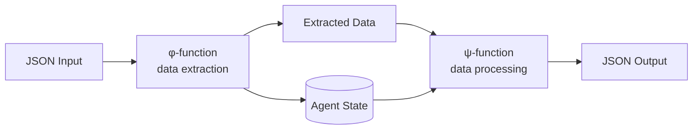
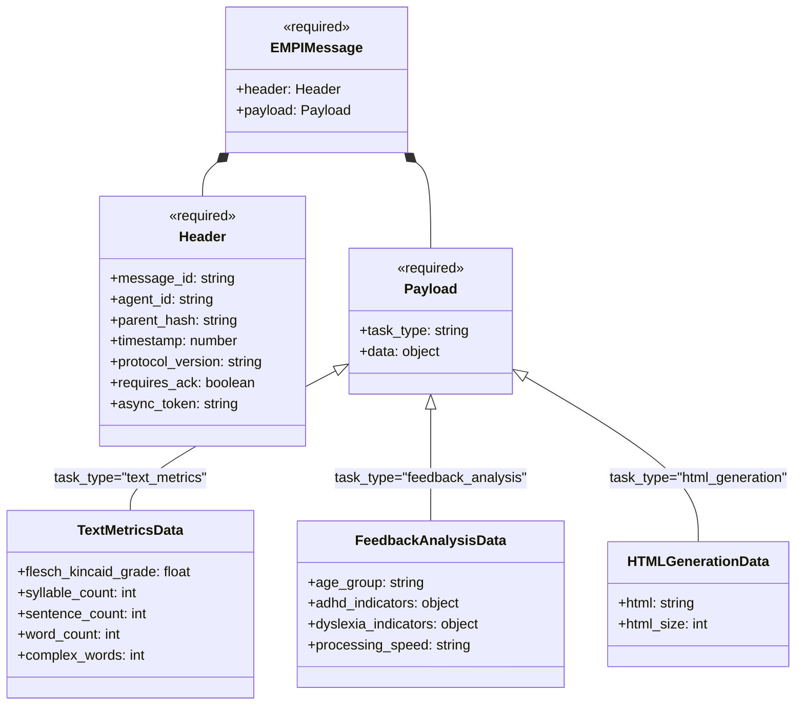
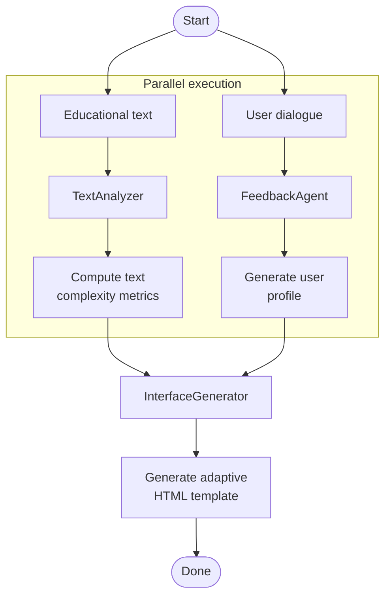

# EMPI Agent Framework

EMPI is a C++ framework for inclusive education

## φ-ψ Handler Architecture

The `UniversalAgent` is a base class for all agents

### Data Flow



The φ-function (data extraction) extracts relevant information from the EMPI message payload and updates the agent's state

The ψ-function processes the extracted data and returns the result as the payload data field of a new EMPI message

### EMPI Protocol Message Structure

All agents communicate using the EMPI protocol — a standardized JSON format for message exchange within the framework



Example EMPI message:
```json
{
  "header": {
    "message_id": "msg_1234567890_text_analyzer",
    "agent_id": "text_analyzer",
    "parent_hash": "",
    "timestamp": 1234567890,
    "protocol_version": "1.0"
  },
  "payload": {
    "task_type": "text_metrics",
    "data": {}
  }
}
```

## Agents

### TextAnalyzer

Text analysis agent for neurodiversity assessment (ASD/ADHD support)

- Analyzes text complexity and readability
- Computes 20+ readability metrics (Flesch-Kincaid, Gunning Fog, etc)
- Provides complexity labels (simple/moderate/complex)
- Estimates accessibility levels for neurodiverse readers

Input:
```json
{
  "text": "The water cycle describes the movement of water on Earth."
}
```

Output payload.data:
```json
{
  "status": "success",
  "analysis_id": "analyze_1",
  "metrics": {
    "flesch_kincaid_grade": 8.2,
    "flesch_reading_ease": 65.3,
    "gunning_fog": 9.1,
    "smog_index": 7.8,
    "automated_readability_index": 7.5,
    "coleman_liau_index": 8.4,
    "dale_chall_score": 7.2,
    "difficult_words": 3,
    "lexicon_count": 15,
    "sentence_count": 1,
    "character_count": 65,
    "letter_count": 53,
    "syllable_count": 24,
    "avg_syllables_per_word": 1.6,
    "avg_letters_per_word": 3.5,
    "avg_words_per_sentence": 15.0
  },
  "complexity_label": "moderate",
  "accessibility_level": "medium"
}
```

### FeedbackAgent

Analyzes dialog history to extract user needs and preferences using a local LLM

- Extracts dialog history from input
- Analyzes sentiment (positive/neutral/negative)
- Identifies key topics discussed
- Calculates satisfaction score (0-1)
- Extracts complaints and issues
- Generates feedback summary

Input:
```json
{
  "dialog_history": [
    {"role": "user", "content": "I have ADHD and find it hard to focus on long paragraphs."},
    {"role": "assistant", "content": "Thank you for sharing. I'll simplify the text."}
  ]
}
```

Output payload.data:
```json
{
  "status": "success",
  "analysis_id": "fb_1",
  "messages_analyzed": 2,
  "analysis": {
    "sentiment": "neutral",
    "topics": ["ADHD", "focus", "paragraph length"],
    "satisfaction_score": 0.5,
    "complaints": ["long paragraphs difficult to focus on"],
    "feedback_summary": "User has ADHD and struggles with long paragraphs."
  }
}
```

### InterfaceGenerator

Generates HTML interfaces based on text metrics and feedback analysis using a local LLM

- Takes text metrics from TextAnalyzer
- Takes feedback analysis from FeedbackAgent
- Takes original text content
- Generates complete HTML page with inline CSS
- Returns HTML string and size in bytes

Input:
```json
{
  "text_metrics": {
    "flesch_kincaid_grade": 8.2,
    "flesch_reading_ease": 65.3
  },
  "feedback_analysis": {
    "sentiment": "neutral",
    "topics": ["ADHD", "focus"],
    "complaints": ["long paragraphs difficult to focus on"]
  },
  "original_text": "The water cycle describes the movement of water on Earth."
}
```

Output payload.data:
```json
{
  "status": "success",
  "generation_id": "gen_1",
  "html": "<!DOCTYPE html>...",
  "html_size": 2048
}
```

## Orchestration Pattern

Parallel-Sequential Processing Pattern runs TextAnalyzer and FeedbackAgent in parallel as part of the agentic framework, and starts InterfaceGenerate for HTML-template inference



Run:
```bash
./orchestrate_agents -m ../llama-dynamic-context/models/Phi-3-mini-4k-instruct-q4.gguf
```

## Validation 

Node.js script that validates generated HTML against accessibility standards

```javascript
const checker = new HTMLQualityChecker({
    validateHtml: true,    // HTML syntax validation via W3C validator
    checkWcag: true,       // WCAG 2.1 compliance check (Levels A, AA)
    wcagLevel: 'AA'        // Target accessibility level
});
```

### Validation Criteria

The checker validates against the following WCAG 2.1 success criteria:

| Criterion | Description | Level |
|-----------|-------------|-------|
| **1.1.1** | Non-text Content - images have alternative text | A |
| **1.3.1** | Info and Relationships - heading hierarchy is not skipped | A |
| **1.4.3** | Contrast (Minimum) - text has sufficient contrast | AA |
| **2.4.4** | Link Purpose (In Context) - links have meaningful text | A |
| **2.4.7** | Focus Visible - interactive elements have visible focus indicators | AA |
| **3.3.2** | Labels or Instructions - form inputs have associated labels | A |
| **4.1.1** | Parsing - no duplicate ID attributes | A |

Run:
```bash
node test_accessibility.js
```

## Dependencies

- C++17 compiler
- CMake 3.14+
- llama.cpp
- nlohmann/json
- Python 3.8+ with spacy and textstat
- Node.js with jsdom and html-validator

## Build

```bash
mkdir build
cd build
cmake ..
make -j4
```

## Test Data

The test data in `tests/texts.json` and `tests/dialogs.json` is curated synthetic data designed for testing agent functionality

- **texts.json**: 100 educational texts covering various topics including water cycle, photosynthesis, Pythagorean theorem, cell theory, Industrial Revolution, Newton's laws, plate tectonics, periodic table, American Civil War, and DNA
- **dialogs.json**: 100 dialogues where users describe accessibility needs including ADHD, dyslexia, autism, low vision, epilepsy, anxiety, and combinations of conditions

## License

MIT
