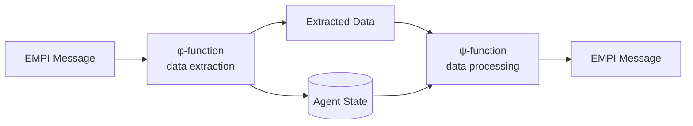
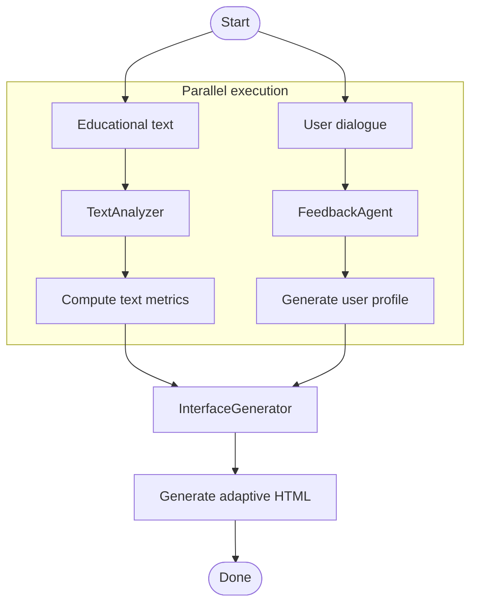

# EMPI Agent Framework

Multi-agent framework for adaptive educational content. Analyzes text + user needs -> generates accessible HTML.


## Quick Start

```bash
git clone https://github.com/vifirsanova/empi_agent
cd empi_agent

# Install Python dependencies
pip install -r requirements.txt
python -m spacy download en_core_web_sm

# Build
mkdir build && cd build
cmake ..
make -j4

# Run CLI
./orchestrate_agents -i ../data/sample.txt

# Run GUI (requires Qt6)
cmake .. -DBUILD_GUI=ON && make
./empi_gui
```

## Configuration

`config/agent_config.toml`:

```toml
[llm]
# Cloud API (OpenAI-compatible)
api_base = "https://api.openai.com/v1"
api_key = ""                    # Empty → fallback to local/mock
model = "gpt-4o-mini"
max_tokens = 8000
temperature = 0.7

# Local model (llama.cpp .gguf)
local_model_path = "models/Phi-3-mini-4k-instruct-q4.gguf"
```

**Fallback chain:** Cloud API -> Local model -> Mock HTML (always works).

## CLI Usage

```bash
./orchestrate_agents -i input.txt [-o output.html] [-p "prompt"] [-c config.toml]

# Options:
#   -i, --input     Input text file (required)
#   -o, --output    Output HTML path (default: output/index.html)
#   -p, --prompt    User prompt for adaptation
#   -c, --config    Config file path
```

## Architecture

### φ-ψ Handler Pattern

`UniversalAgent` base class implements EMPI protocol with function pairs:


```mermaid
flowchart LR
    Input[EMPI Message] --> PHI[φ-function\ndata extraction]
    PHI --> State[(Agent State)]
    PHI --> Extracted[Extracted Data]
    Extracted --> PSI[ψ-function\ndata processing]
    PSI --> Output[EMPI Message]
    State --> PSI
```

### EMPI Message Structure

```json
{
  "header": {
    "protocol": "EMPI/1.0",
    "message_id": "msg_1234567890_text_analyzer",
    "timestamp": "1234567890",
    "agent_id": "text_analyzer",
    "task_type": "text_metrics",
    "version": "1.0"
  },
  "payload": {
    "metadata": {"source": "text_analyzer", "processing_start": "1234567890"},
    "data": {}
  }
}
```

### Orchestration Pattern

TextAnalyzer and FeedbackAgent run in parallel, then InterfaceGenerator executes:


```mermaid
flowchart TD
    Start([Start]) --> Input[Educational text]
    Start --> Dialog[User dialogue]
    
    subgraph Parallel[Parallel execution]
        direction TB
        Input --> TA[TextAnalyzer]
        Dialog --> FA[FeedbackAgent]
        
        TA --> TM[Compute text metrics]
        FA --> UP[Generate user profile]
    end
    
    TM --> IG[InterfaceGenerator]
    UP --> IG
    
    IG --> HTML[Generate adaptive HTML]
    HTML --> Done([Done])
```

## Agents

### TextAnalyzer

Computes 20+ readability metrics via Python (`textstat` + `spaCy`).

**Input:**
```json
{"text": "The water cycle describes the movement of water on Earth."}
```

**Output:**
```json
{
  "status": "success",
  "metrics": {
    "flesch_kincaid_grade": 8.2,
    "flesch_reading_ease": 65.3,
    "gunning_fog": 9.1,
    "smog_index": 7.8,
    "dale_chall_score": 7.2,
    "difficult_words": 3
  },
  "complexity_label": "moderate",
  "accessibility_level": "medium"
}
```

### FeedbackAgent

Analyzes dialog history via LLM to extract user needs.

**Input:**
```json
{
  "dialog_history": [
    {"role": "user", "content": "I have ADHD and struggle with long paragraphs."}
  ]
}
```

**Output:**
```json
{
  "status": "success",
  "analysis": {
    "sentiment": "neutral",
    "topics": ["ADHD", "focus"],
    "satisfaction_score": 0.5,
    "complaints": ["long paragraphs difficult to focus on"],
    "feedback_summary": "User has ADHD and struggles with long paragraphs."
  }
}
```

### InterfaceGenerator

Generates HTML using local LLM (llama.cpp) or cloud API.

**Output:**
```json
{
  "status": "success",
  "html": "<!DOCTYPE html>...",
  "html_size": 2048
}
```

## Validation

Accessibility validation against WCAG 2.1 (Levels A, AA):

| Criterion | Description | Level |
|-----------|-------------|-------|
| 1.1.1 | Images have alt text | A |
| 1.3.1 | Heading hierarchy not skipped | A |
| 1.4.3 | Sufficient text contrast | AA |
| 2.4.4 | Links have meaningful text | A |
| 2.4.7 | Visible focus indicators | AA |
| 4.1.1 | No duplicate IDs | A |

```bash
npm install jsdom html-validator
node test_accessibility.js
```

## GUI Features

- Drag & drop file upload (supports PDF, txt, plain input)
- Preset adaptation prompts (ADHD-friendly, Dyslexia-friendly, For children, Beginner)
- Split view: chat + live preview
- Language toggle (EN/RU)
- Download/export HTML

## Test Data

Test corpus consists of real accessibility documentation from three authoritative sources:

- **W3C WAI** (`w3c_accessibility_texts/`): WCAG 2.1/2.2 guidelines, techniques (HTML, CSS, ARIA, client-side script), failures, and understanding documents
- **WAI** (`wai_texts/`): Tutorials, business cases, fundamentals, planning resources, and role-specific guides
- **WebAIM** (`webaim_texts/`): Articles on screen readers (JAWS, NVDA, VoiceOver), cognitive/visual/motor disabilities, contrast, forms, tables, and strategic implementation

All files are plain text extracts from official accessibility standards and educational materials, used for testing text adaptation across diverse real-world content.

## Testing Suite

EMPI includes comprehensive testing across multiple levels: unit tests, integration tests, pipeline tests, accessibility validation, and user profile simulation.

### Test Structure

```
tests/
├── test_llm_client.cpp          # LLM connectivity and script availability
├── test_interface_generator.cpp # HTML generation with local/cloud LLM
├── test_pipeline.cpp             # End-to-end agent orchestration
├── test_accessibility.js         # WCAG 2.1 compliance checker
└── user_profiles.json            # 100 synthetic user profiles for simulation
```

### Unit Tests

#### LLMClient Test (`test_llm_client.cpp`)

Validates LLM availability and basic generation:

```cpp
EMPI::LLMClient client("python3");
if (!client.is_available()) return 1;

std::string result = client.generate("Say hello in exactly one word.");
json parsed = client.generate_json("Say hello in exactly one word.");
```

**Checks:** Python script exists, JSON parsing, text extraction.

#### InterfaceGenerator Test (`test_interface_generator.cpp`)

Tests HTML generation with mock metrics and feedback:

```cpp
json metrics = {{"flesch_kincaid_grade", 10.5}, {"complexity_label", "moderate"}};
json feedback = {{"sentiment", "neutral"}, {"complaints", {"long paragraphs"}}};

json input = {{"text_metrics", metrics}, {"feedback_analysis", feedback}, {"original_text", text}};
json result = gen.process_raw(input);
```

**Output:** `build/index.html`

### Pipeline Test (`test_pipeline.cpp`)

End-to-end orchestration:

1. **TextAnalyzer** processes sample text → complexity metrics
2. **FeedbackAgent** analyzes dialog → user profile
3. **InterfaceGenerator** combines both → adaptive HTML

```cpp
json ta_result = text_agent.process_raw({{"text", sample_text}});
json fa_result = feedback_agent.process_raw({{"dialog_history", dialog}});
json ig_result = interface_gen.process_raw({{"text_metrics", metrics}, {"feedback_analysis", feedback}});
```

**Output:** `build/test_output.html`

### Accessibility Validation (`test_accessibility.js`)

WCAG 2.1 compliance checker (Levels A, AA):

| Criterion | Check | Level |
|-----------|-------|-------|
| 1.1.1 | Images have alt text | A |
| 1.3.1 | Heading hierarchy | A |
| 1.4.3 | Text contrast | AA |
| 2.4.4 | Link purpose | A |
| 2.4.7 | Focus visible | AA |
| 4.1.1 | No duplicate IDs | A |

```bash
npm install jsdom html-validator
node test_accessibility.js --json
```

### User Profiles (`user_profiles.json`)

100 synthetic profiles for simulation testing, covering:

**Single conditions:**
- Dyslexia (mild/moderate/marked) — font preferences, overlays, spacing
- ADHD (mild/moderate/marked) — chunking, progress indicators, animations
- ASD (mild/moderate/marked) — literal language, predictable navigation

**Comorbid conditions:**
- ASD + ADHD — overstimulation risk, ultra-chunked content
- Dyslexia + ADHD — OpenDyslexic, progress tracking
- ASD + Dyslexia — literal language + font adaptations
- Triple (ASD + ADHD + Dyslexia) — all combined settings

**Additional features:**
- Light sensitivity > dark mode
- Auditory sensitivity > text-only
- Scotopic sensitivity > colored overlays

Each profile includes:
- `natural_language_prompt` — user's own words
- `cognitive_profile` — condition, severity, deficits
- `accessibility_settings` — actionable CSS/layout rules

### Build & Run Tests

```bash
cd build
cmake .. -DBUILD_TESTS=ON
make

# Run individual tests
./test_llm_client
./test_interface_generator
./test_pipeline

# Run all tests
ctest --output-on-failure
```

## Requirements

- C++17, CMake 3.14+
- Python 3.8+ with `spacy`, `textstat`, `openai`, `tomli`
- Node.js with `jsdom`, `html-validator` (optional)
- Qt6 (optional, for GUI)

## License

MIT
