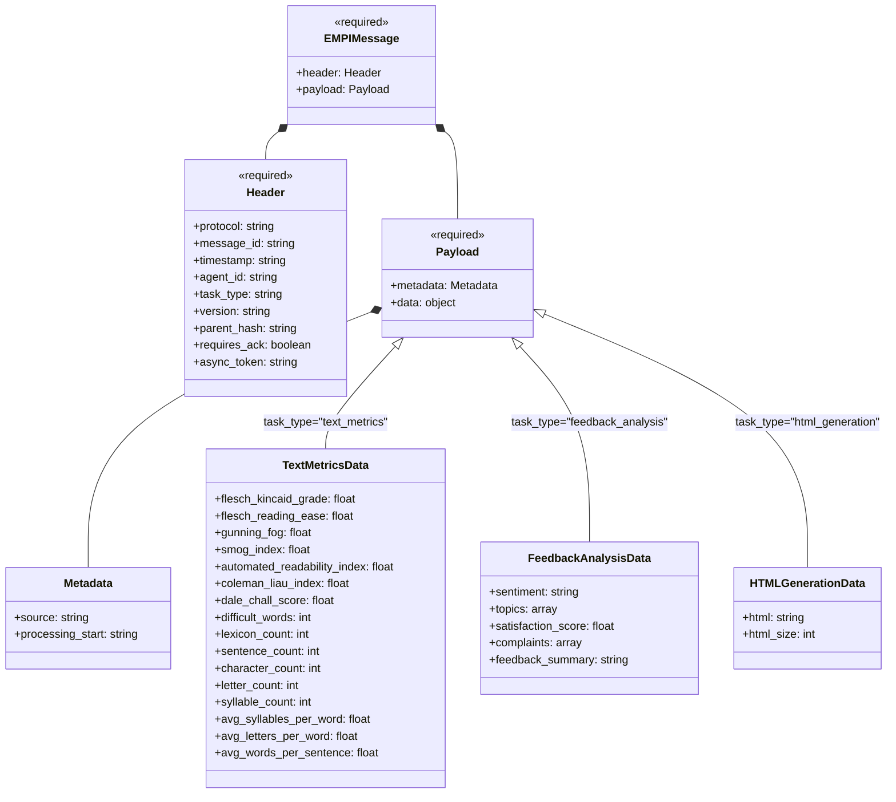
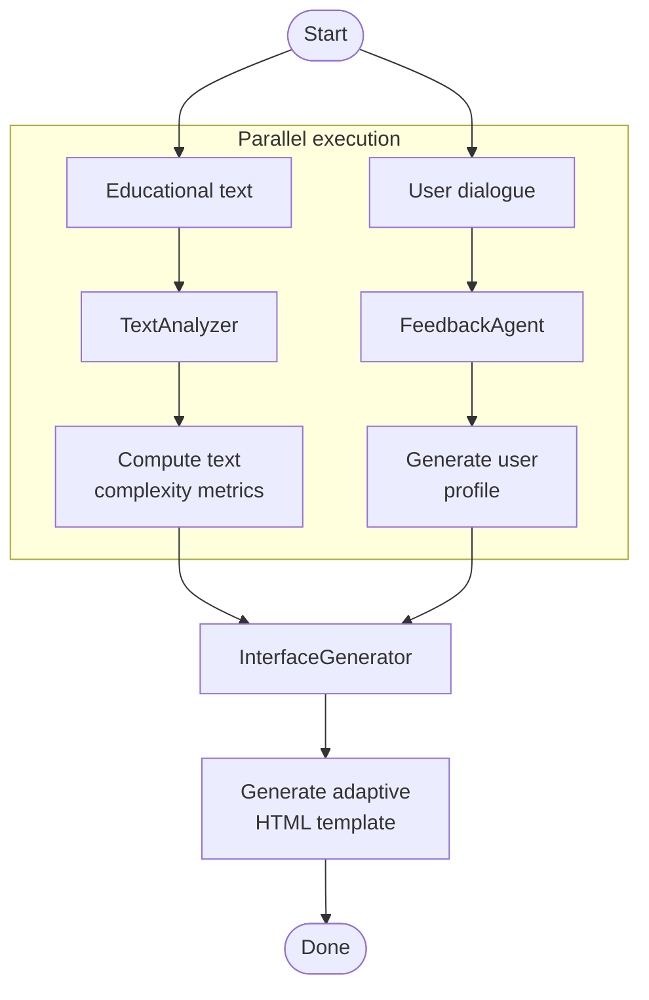

# EMPI Agent Framework

EMPI is a multi-agent framework for inclusive education. The framework adapts learning materials to neurodivergent students.

Takes any text - analyzes complexity + user needs = generates adapted HTML page.

## Quick Start

```bash
# 1. Clone & install everything
git clone https://github.com/vifirsanova/empi_agent
cd empi_agent
chmod +x run.sh && ./run.sh

# 2. Edit config (optional — works in mock mode without it)
nano config/agent_config.toml
```

## Usage

### CLI

```bash
# Basic: adapt a text file
./build/orchestrate_agents -i data/sample.txt

# With accessibility prompt
./build/orchestrate_agents -i data/sample.txt \
  -p "I have ADHD, use short paragraphs and highlight key points" \
  -o adapted.html

# Read prompt from file
./build/orchestrate_agents -i data/paper.txt --prompt-file my_needs.txt
```

### GUI

```bash
cd build && cmake .. -DBUILD_GUI=ON && make
./empi_gui
```

Drag & drop a `.txt` file, optionally describe your needs, click **Adapt & Render**.

## Config

`config/agent_config.toml`:

```toml
[llm]
# Cloud API (Yandex Cloud / OpenAI-compatible)
api_base = "https://ai.api.cloud.yandex.net/v1"
api_key = ""        # leave empty → auto fallback
folder_id = ""
model = "yandexgpu/latest"

# Local model (llama.cpp)
local_model_path = "models/Phi-3-mini-4k-instruct-q4.gguf"
```

**Fallback order:** Cloud > Local > Mock (always works, no keys needed).

## Requirements

- C++17, CMake 3.14+
- Python 3.8+ (`spacy`, `textstat`, `openai`)
- Node.js (`jsdom`, `html-validator` — for accessibility checks)
- Qt6 (optional, for GUI)

---

Examples of generated interfaces: 


GUI:


[See example usage video (in Russian)](https://rutube.ru/video/private/1aed219bc7195d647ee1c0f14ab8b27b/?p=zoZ1pfYuOz2soGRDt-q5UQ)

---

## Test Data
The `tests/` folder contains two JSON files used for evaluation:

- **`texts.json`**: 100 educational texts covering biology, physics, history, literature, and computer science. Each entry contains:
  ```json
  {
    "id": "text_0042",
    "content": "The water cycle describes how water evaporates..."
  }
  ```

- **`dialogs.json`**: 100 synthetic dialogue histories simulating user interactions. Each entry contains:
  ```json
  {
    "id": "dialogue_0001",
    "history": [
      {"role": "user", "content": "I have ADHD and find it hard to focus on long paragraphs..."}
    ]
  }
  ```

These files are used by `test_orchestration.cpp` to generate all 10,000 text-dialogue combinations (100×100) for evaluation, as described in the paper.

## φ-ψ Handler Architecture

The `UniversalAgent` is a base class for all agents

### Data Flow

```memraid
flowchart LR
    Input[EMPI Message] --> PHI[φ-function\ndata extraction]
    PHI --> State[(Agent State)]
    PHI --> Extracted[Extracted Data]
    Extracted --> PSI[ψ-function\ndata processing]
    PSI --> Output[EMPI Message]
    State --> PSI
```

The φ-function (data extraction) extracts relevant information from the EMPI message payload and updates the agent's state

The ψ-function processes the extracted data and returns the result as the payload data field of a new EMPI message

### EMPI Protocol Message Structure

All agents communicate using the EMPI protocol — a standardized JSON format for message exchange within the framework


```mermaid
classDiagram
    class EMPIMessage {
        <<required>>
        +header: Header
        +payload: Payload
    }

    class Header {
        <<required>>
        +protocol: string
        +message_id: string
        +timestamp: string
        +agent_id: string
        +task_type: string
        +version: string
        <<optional>>
        +parent_hash: string
        +requires_ack: boolean
        +async_token: string
    }

    class Payload {
        <<required>>
        +metadata: Metadata
        +data: object
    }

    class Metadata {
        +source: string
        +processing_start: string
    }

    class TextMetricsData {
        +flesch_kincaid_grade: float
        +flesch_reading_ease: float
        +gunning_fog: float
        +smog_index: float
        +automated_readability_index: float
        +coleman_liau_index: float
        +dale_chall_score: float
        +difficult_words: int
        +lexicon_count: int
        +sentence_count: int
        +character_count: int
        +letter_count: int
        +syllable_count: int
        +avg_syllables_per_word: float
        +avg_letters_per_word: float
        +avg_words_per_sentence: float
    }

    class FeedbackAnalysisData {
        +sentiment: string
        +topics: array
        +satisfaction_score: float
        +complaints: array
        +feedback_summary: string
    }

    class HTMLGenerationData {
        +html: string
        +html_size: int
    }

    EMPIMessage *-- Header
    EMPIMessage *-- Payload
    Payload *-- Metadata
    Payload <|-- TextMetricsData : task_type="text_metrics"
    Payload <|-- FeedbackAnalysisData : task_type="feedback_analysis"
    Payload <|-- HTMLGenerationData : task_type="html_generation"
```

Example EMPI message:
```json
{
  "header": {
    "protocol": "EMPI/1.0",
    "message_id": "msg_1234567890_text_analyzer",
    "timestamp": "1234567890",
    "agent_id": "text_analyzer",
    "task_type": "text_metrics",
    "version": "1.0"
  },
  "payload": {
    "metadata": {
      "source": "text_analyzer",
      "processing_start": "1234567890"
    },
    "data": {}
  }
}
```

## Agents

### TextAnalyzer

Text analysis agent for neurodiversity assessment (ASD/ADHD support)

- Analyzes text complexity and readability
- Computes 20+ readability metrics (Flesch-Kincaid, Gunning Fog, etc)
- Provides complexity labels (simple/moderate/complex)
- Estimates accessibility levels for neurodiverse readers

Input payload.data:
```json
{
  "text": "The water cycle describes the movement of water on Earth."
}
```

Output payload.data:
```json
{
  "status": "success",
  "analysis_id": "analyze_1",
  "metrics": {
    "flesch_kincaid_grade": 8.2,
    "flesch_reading_ease": 65.3,
    "gunning_fog": 9.1,
    "smog_index": 7.8,
    "automated_readability_index": 7.5,
    "coleman_liau_index": 8.4,
    "dale_chall_score": 7.2,
    "difficult_words": 3,
    "lexicon_count": 15,
    "sentence_count": 1,
    "character_count": 65,
    "letter_count": 53,
    "syllable_count": 24,
    "avg_syllables_per_word": 1.6,
    "avg_letters_per_word": 3.5,
    "avg_words_per_sentence": 15.0
  },
  "complexity_label": "moderate",
  "accessibility_level": "medium"
}
```

### FeedbackAgent

Analyzes dialog history to extract user needs and preferences using a local LLM

- Extracts dialog history from input
- Analyzes sentiment (positive/neutral/negative)
- Identifies key topics discussed
- Calculates satisfaction score (0-1)
- Extracts complaints and issues
- Generates feedback summary

Input payload.data:
```json
{
  "dialog_history": [
    {"role": "user", "content": "I have ADHD and find it hard to focus on long paragraphs."},
    {"role": "assistant", "content": "Thank you for sharing. I'll simplify the text."}
  ]
}
```

Output payload.data:
```json
{
  "status": "success",
  "analysis_id": "fb_1",
  "messages_analyzed": 2,
  "analysis": {
    "sentiment": "neutral",
    "topics": ["ADHD", "focus", "paragraph length"],
    "satisfaction_score": 0.5,
    "complaints": ["long paragraphs difficult to focus on"],
    "feedback_summary": "User has ADHD and struggles with long paragraphs."
  }
}
```

### InterfaceGenerator

Generates HTML interfaces based on text metrics and feedback analysis using a local LLM (inference)

- Takes text metrics from TextAnalyzer
- Takes feedback analysis from FeedbackAgent
- Takes original text content
- Generates complete HTML page with inline CSS
- Returns HTML string and size in bytes

Input payload.data:
```json
{
  "text_metrics": {
    "flesch_kincaid_grade": 8.2,
    "flesch_reading_ease": 65.3
  },
  "feedback_analysis": {
    "sentiment": "neutral",
    "topics": ["ADHD", "focus"],
    "complaints": ["long paragraphs difficult to focus on"]
  },
  "original_text": "The water cycle describes the movement of water on Earth."
}
```

Output payload.data:
```json
{
  "status": "success",
  "generation_id": "gen_1",
  "html": "<!DOCTYPE html>...",
  "html_size": 2048
}
```

## Orchestration Pattern

Parallel-Sequential Processing Pattern runs TextAnalyzer and FeedbackAgent in parallel as part of the agentic framework, then starts InterfaceGenerator for HTML generation


```mermaid
flowchart TD
    Start([Start]) --> Input[Educational text]
    Start --> Dialog[User dialogue]
    
    subgraph Parallel[Parallel execution]
        direction TB
        Input --> TA[TextAnalyzer]
        Dialog --> FA[FeedbackAgent]
        
        TA --> TM[Compute text<br/>complexity metrics]
        FA --> UP[Generate user<br/>profile]
    end
    
    TM --> IG[InterfaceGenerator]
    UP --> IG
    
    IG --> HTML[Generate adaptive<br/>HTML template]
    
    HTML --> Done([Done])
```

Run:
```bash
./orchestrate_agents -m ../llama-dynamic-context/models/Phi-3-mini-4k-instruct-q4.gguf
```

## Validation 
Node.js script that validates generated HTML against accessibility standards

```javascript
const checker = new HTMLQualityChecker({
    validateHtml: true,    // HTML syntax validation via W3C validator
    checkWcag: true,       // WCAG 2.1 compliance check (Levels A, AA)
    wcagLevel: 'AA'        // Target accessibility level
});
```

### Validation Criteria

The checker validates against the following WCAG 2.1 success criteria:

| Criterion | Description | Level |
|-----------|-------------|-------|
| **1.1.1** | Non-text Content - images have alternative text | A |
| **1.3.1** | Info and Relationships - heading hierarchy is not skipped | A |
| **1.4.3** | Contrast (Minimum) - text has sufficient contrast | AA |
| **2.4.4** | Link Purpose (In Context) - links have meaningful text | A |
| **2.4.7** | Focus Visible - interactive elements have visible focus indicators | AA |
| **3.2.2** | On Input - selecting a control does not automatically cause a context change | A |
| **3.3.2** | Labels or Instructions - form inputs have associated labels | A |
| **4.1.1** | Parsing - no duplicate ID attributes | A |
| **4.1.2** | Name, Role, Value - ARIA roles are valid | A |

Run:
```bash
node test_accessibility.js
```

## Dependencies

- C++17 compiler
- CMake 3.14+
- llama.cpp
- nlohmann/json
- Python 3.8+ with spacy and textstat
- Node.js with jsdom and html-validator

## Test Data

The test data in `tests/texts.json` and `tests/dialogs.json` is curated synthetic data designed for testing agent functionality

- **texts.json**: 100 educational texts covering various topics including water cycle, photosynthesis, Pythagorean theorem, cell theory, Industrial Revolution, Newton's laws, plate tectonics, periodic table, American Civil War, and DNA
- **dialogs.json**: 100 dialogues where users describe accessibility needs including ADHD, dyslexia, autism, low vision, epilepsy, anxiety, and combinations of conditions

## License

MIT
